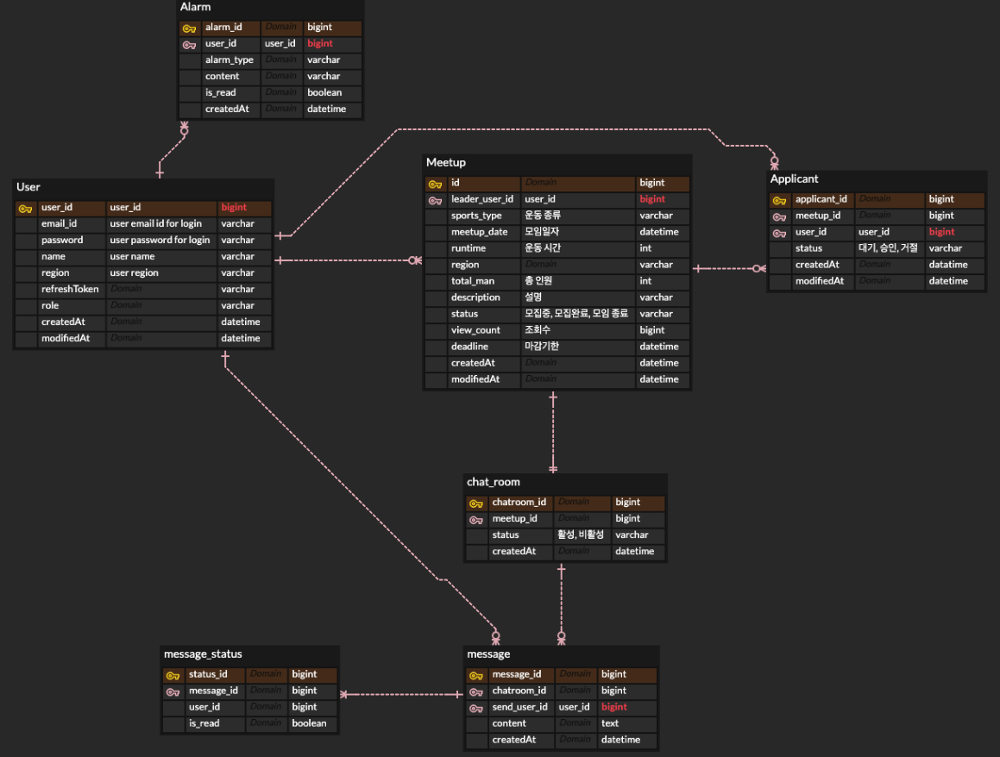

# sports meetup community

주변에 같은 운동하고자 하는 사람들의 운동 모임

- 운동 종류, 시간, 장소, 인원을 특정하여 모집글을 올려 같이 운동하는 모임을 만드는 커뮤니티 서비스를 만들고자 합니다.

### 사용 기술
spring boot / spring data JPA / SSE / Web Socket

---

### 기능

[회원 가입]
- [ ] 이메일 인증 회원가입

[회원 정보]
- [ ]  기본 회원 정보 조회
- [ ]  등록한 모임 현황 
- [ ]  신청한 모임 현황 (대기, 승인, 거절)
- [ ]  참여 완료한 모임 조회 

[모임 등록]
        
- [ ] 제목, 운동 종류, 시간, 장소, 인원, 간단한 설명을 적어 게시글 형식으로 게시 (이때 운동 종류는 서비스상에 정해진 값들 중 선택)

[등록된 모임 조회]

- [ ] 운동 종류별, 또는 위치에 해당하는 모임 조회(제목, 운동 종류, 시간, 장소, 인원, 간단한 설명)

[모임 참여]

- [ ] 모집중인 경우 참가 신청 (마감날짜 지나지 않음 & 모집 인원 남음)
- [ ] 신청 후 모임 주최자가 승인 혹은 거절
- [ ] 승인 혹은 거절 시 참여 신청자에게 알림보내기

[채팅 기능]

- [ ] 채팅방 생성
  - 모임당 채팅방 1개 
  - 처음 모임 게시글 올린 회원을 모임장으로 채팅방 생성
  - 해당 모임에 신청하고 승인된 회원 자동 참가
- [ ] 채팅방 해지
    - 모임 날짜 이후 자동 해지 
    - 모임 날짜 이전에도 채팅방 인원이 모두 나갈시, 또는 모임장이 해지 가능
- [ ] 그룹 채팅
    - 텍스트 메세지
    - 읽음 표시
    - 로그인시 읽지 않은 메세지 불러오기

---
### ERD
